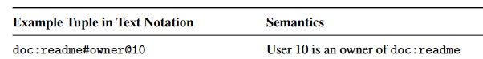
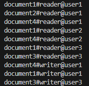
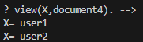
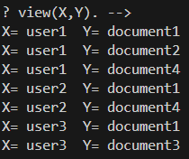
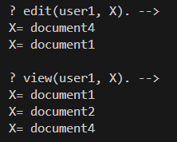

# Google Zanzibar Access Management  language-like with Golang + Prolog in less than 150 lines of code

Zanzibar handles authorization for YouTube, Drive, Google Cloud and all of Google's other products.
Zanzibar is a globally distributed authorization system capable of processing million of client queries per second.

See (_later_) zanzibar : Google's Consistent, Global Authorization System
https://storage.googleapis.com/pub-tools-public-publication-data/pdf/0749e1e54ded70f54e1f646cd440a5a523c69164.pdf

At first glance Google's paper is not easy to read, i had to read the paper many times. (You may experience headache)

Fortunately this paper was annotated by the authzed company (https://zanzibar.tech/) which provides an implementation (https://authzed.com/spicedb) developed in Go.

There are today several access management solutions  that are inspired by zanzibar (zanzibar is exclusively used by Google).

Most zanzibar-like solutions are developed in Golang (zanzibar included) and sometimes in Rust.

The code provided here is a didactic example based on Role-based Access Control (RBAC) to understand the spirit of the zanzibar language.

> The difficulty of implementing a solution like zanzibar is not in the language but lies in the execution of Prolog-type queries on a distributed architecture.
> We have to make sure that the rules are up to date everywhere in the nodes of the network.
> But that's another story that google names the "new enemy problem".

# Prolog

When I read the google paper I immediately thought of prolog. Alain Colmerauer created prolog in 1972 in Marseille.
(I was born in Marseille and I discovered prolog there)

Prolog is a declarative programming language designed for developing logic-based AI application.

For this example I found the Ichiban Prolog library developed in Go.

# Data Model example (i.e the policy): RBAC modeled with relationships 

- A reader relationship declares an user X who can read an object Y
- A writer relationship declares a writer X who can write an object Y
- X = user, Y = object

> Prolog rules :

> reader(X,Y) :- relation(X,reader,Y).
>
> writer(X,Y) :- relation(X,writer,Y).

- Edit indicates that the user has permission to edit the resource document. 
- View indicates that the user has permission to view the resource document, if they are a reader OR have edit permission.
- OR is noted ';' in prolog

> Prolog rules

> edit(X,Y) :- writer(X,Y).
> 
> view(X,Y) :- reader(X,Y) ; edit(X,Y). 

> RBAC Model becames set of rules in Prolog and is a set of relations in Zanzibar.

# Data example in Zanzibar format 

A tuple (i.e relationship) is noted as follows object#relation@user in the zanzibar format

(_extract from google paper_)

At the beginning of the program launch, the data used in this example are printed in Zanzibar format.

A simplified Extented BNF grammar of tuples can be written as follows :

> tuples ::= tuple { " " tuple }
>
> tuple ::= object "#" relation "@" user
>
> object ::= namespace ":" object_id
>
> user  ::= namespace ":" user_id 
>
> ...

To simplify, I don't include the ':' separation between the object type and the identifier

You have to get used to reading from right to left the resource:id#relation@user:id

> Tuples in Zanzibar became Prolog facts
>
> Example : 'document1#reader@user1' is translated in Ichiban Prolog as  'relation(user1,reader,document1).'

All we have to do now is to interrogate the facts with the model

 # Check Permissions

Who can view the document 4 ?

Response : User 1 and User 2 can view document 4

Who can view what ?

> Calculating permissions in Zanzibar becomes calculating a Prolog query

In Zanzibar vocabulary the above questions are called __Expand__

__Expand__

- returns at least the effective set of users  given an object and a relation. 
- is difficult to compute in distributed architecture 
- is a crucial feature which allows the client to build efficient search indices for access-controlled content.

> In reality, result implementation must represent a set of users tree whose leaf nodes are user IDs and intermediate nodes represent union, intersection, or exclusion operators.

We have used the union operator (which means 'OR' and is noted ';' in prolog ) with the rule  _view(X,Y) :- reader(X,Y) ; edit(X,Y)._

What can user do ?

In Zanzibar vocabulary this question is called __Reverse Index Expand__ 

User1 can edit document 1 and document 4

User1 can view document 1,document 2 and document 4

That's all.

If i had to summarize for the zanzibar queries:

| Zanzibar             |  query  | response at least | compute the response|
|----------------------|---------|----------|---------|
| Evaluate             | is _user_ allowed to _permission_ _object_ ? | yes/no | easy  |
| Expand               |   who can _permission_ _object_  ? |   a list |  difficult   |
| Reverse Index Expand |   what can _user_ do ?       |    a list| difficult |

# Run

Under prologzanzibar tape go run main.go

I hope that this little presentation on zanzibar will make you want to go further.